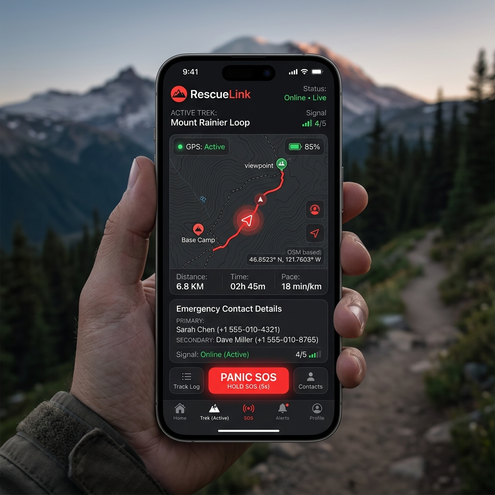
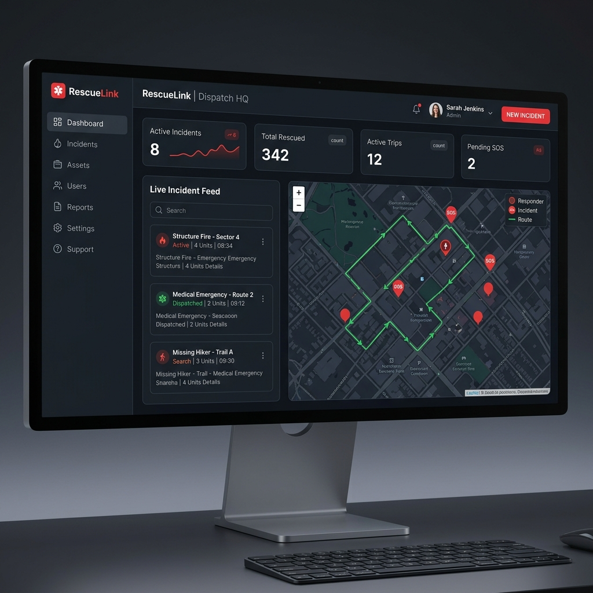
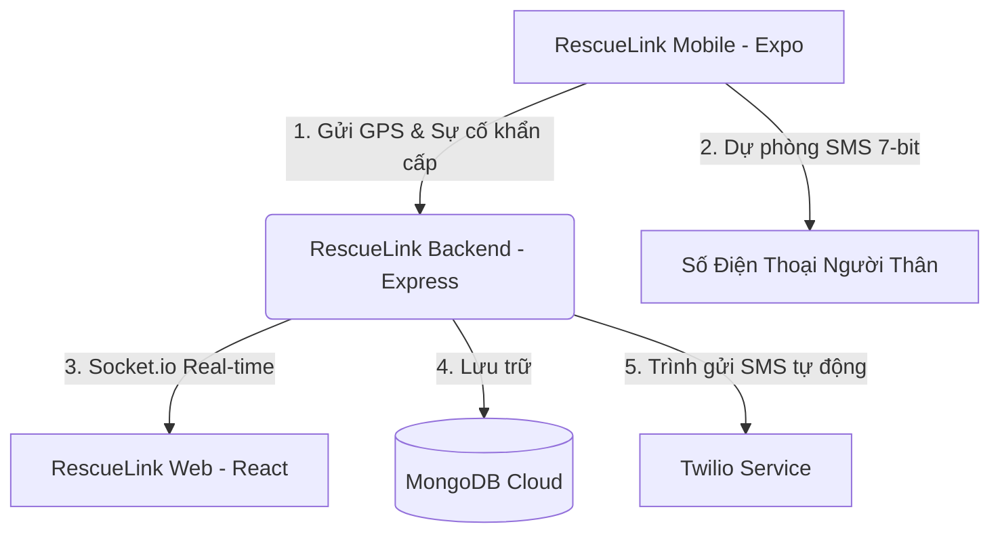

# 🚨 RescueLink - Emergency & Outdoor Safety Platform

**RescueLink** (RescueAI) là nền t án an toàn dã ngoại và cứu trợ khẩn cấp thông minh, được thiết kế để hỗ trợ người leo núi (trekking) và thám hiểm trong các tình huống đi lạc, gặp tai nạn hoặc mất liên lạc ở khu vực rừng núi sâu. Hệ thống kết hợp định vị ngầm thích ứng, bản đồ ngoại tuyến, phát hiện bất thường bằng AI, và cơ chế gửi tín hiệu khẩn cấp đa phương thức (WebSockets/SMS).

---

## 📸 Giao diện Hệ thống

### 1. 📱 Ứng dụng Di động (RescueLink Mobile App)
Giao diện bản đồ tích hợp định vị trực quan, tìm kiếm ngoại tuyến, ghim thông báo trạng thái thường trực và nút kích hoạt Cấp cứu khẩn cấp an toàn:



### 2. 🖥️ Bảng điều khiển Trung tâm Cứu hộ (RescueLink Web Dashboard)
Bảng điều khiển thời gian thực dành cho đội cứu hộ chuyên nghiệp để giám sát vị trí thành viên, phân tích chỉ số pin và quản lý các sự cố khẩn cấp tức thì:



---

## 🛠️ Công nghệ Sử dụng & Đánh giá Kiến trúc

Hệ thống được chia làm 3 thành phần chính hoạt động độc lập và đồng bộ với nhau qua REST API và WebSockets:



### 1. 📱 Mobile App (`rescuelink-app`)
*   **Công nghệ**: Expo SDK 54, React Native, TypeScript, Nativewind (Tailwind CSS v4).
*   **Định vị ngầm**: Sử dụng `expo-location` và `expo-task-manager` đăng ký tác vụ chạy ẩn hệ thống (`background-location-task`). Cơ chế cập nhật tần số thích ứng thông minh dựa trên dung lượng pin và vận tốc di chuyển thực tế để tiết kiệm pin tối đa.
*   **Bản đồ & Chỉ đường Ngoại tuyến**:
    *   Sử dụng `react-native-maps` hiển thị bản đồ địa hình.
    *   Tự động tải trước và lưu trữ cục bộ (Tile Cache) các phân mảnh bản đồ vùng núi cận kề qua slippy map coordinate math (`lon2tile`/`lat2tile`) với buffer bán kính 3x3 và 5x5.
    *   Lưu trữ ngoại tuyến các tuyến đường chỉ dẫn qua lưu cache OSRM vào `AsyncStorage`.
*   **Hệ thống Cảnh báo & Âm thanh**:
    *   Sử dụng `expo-av` để phát âm thanh cảnh báo lớn ngoại tuyến trong đếm ngược 10s.
    *   Sử dụng `expo-notifications` quản lý các cảnh báo hệ thống và ghim thông báo hành trình thường trực (`ongoing: true`/`sticky: true`) trên khay trạng thái hệ điều hành Android/iOS.

### 2. 🖥️ Web Operator Dashboard (`rescuelink-web`)
*   **Công nghệ**: React 19, Vite, Tailwind CSS v3, React Router v7.
*   **Bản đồ Giám sát**: Leaflet & React-Leaflet vẽ tọa độ hành trình và các vùng khoanh vùng cứu hộ khẩn cấp thời gian thực.
*   **Thời gian thực**: Tích hợp `socket.io-client` để đồng bộ vị trí di chuyển và thông báo sự cố ngay lập tức mà không cần tải lại trang.
*   **Biểu đồ Thống kê**: Sử dụng `recharts` biểu diễn biến động dung lượng pin, khoảng cách di chuyển và mức độ lệch đường đi của thành viên.

### 3. ⚙️ Backend API Server (`rescuelink-backend`)
*   **Công nghệ**: Node.js, Express 5, MongoDB & Mongoose.
*   **Kết nối**: Socket.io (v4) quản lý kết nối thời gian thực hai chiều giữa thiết bị di động và bảng điều khiển cứu hộ.
*   **Dự phòng & Gửi tin tự động**:
    *   Tích hợp SDK Twilio gửi tin nhắn SMS khẩn cấp tự động.
    *   Sử dụng `node-cron` chạy các tác vụ nền quét thời hạn hành trình định kỳ và tự động kích hoạt báo động mất liên lạc nếu thành viên dừng check-in quá giờ quy định.

---

## 🔄 Quy trình Hoạt động Cấp cứu Đặc biệt

### 1. Cơ chế Nhấn Đúp (Double-tap) & Đếm ngược 10s tránh bấm nhầm do Nước
*   **Thách thức**: Người leo núi đi trong rừng thường gặp mưa, tay bị ướt hoặc kẹp máy vào đai đeo, nếu dùng nút nhấn giữ (long press) hoặc chạm đơn rất dễ bị trượt cảm ứng hoặc kích hoạt giả.
*   **Quy trình**:
    1.  Người dùng chạm 1 lần: Ứng dụng hiển thị Tooltip nhắc nhở `"🚨 NHẤN ĐÚP 2 LẦN LIÊN TỤC ĐỂ BÁO CỨU HỘ"` và ẩn sau 2.5s.
    2.  Chạm 2 lần liên tiếp (< 1s): Ứng dụng kích hoạt Overlay toàn màn hình, chặn tất cả thao tác bản đồ.
    3.  Ứng dụng đếm ngược lùi từ 10 về 0. Mỗi giây trôi qua, thiết bị phát âm thanh bíp lớn và rung mạnh liên tục.
    4.  Nếu là kích hoạt nhầm, người dùng chỉ cần chạm nút **"HỦY CẤP CỨU"** để khôi phục lại trạng thái cũ.
    5.  Sau 10 giây (hoặc bấm **"GỬI CỨU HỘ NGAY"**), tín hiệu khẩn cấp sẽ tự động gửi đi mà không cần thao tác gì thêm.

### 2. Nén Dữ liệu SMS SOS Siêu nhẹ cho Vùng Sóng Yếu
*   **Thách thức**: Trong rừng sâu, sóng di động thường chập chờn (chỉ có 1 vạch sóng vụt qua rồi mất). Tin nhắn SMS dài/chứa tiếng Việt có dấu sẽ bị chia làm nhiều phân đoạn (Multi-part SMS) dẫn đến tỷ lệ thất bại rất cao.
*   **Giải pháp**: Hệ thống sử dụng thuật toán đóng gói chuỗi ASCII không dấu, nén tọa độ GPS xuống 5 chữ số thập phân (vẫn đảm bảo sai số tối đa chỉ ~1.1 mét):
    `SOS RescueLink! maps.google.com/?q=21.02854,105.85421` (Đúng 53 ký tự ASCII).
*   **Hiệu quả**: Tin nhắn ngắn hơn 60 ký tự, nằm gọn trong 1 phân đoạn truyền tải cơ bản (Single Segment GSM 7-bit tối đa 160 ký tự), nâng xác suất gửi tin thành công lên gấp **5 lần** khi sóng cực kỳ yếu.

### 3. Phát hiện Bất thường bằng AI (AI Anomaly Detection)
*   **Đi lòng vòng (Going in Circles)**: Nếu quãng đường di chuyển > 1500m nhưng khoảng cách thực tế so với vị trí 30 phút trước đó < 200m -> AI suy luận người dùng đang bị đi lạc vòng tròn (mất định hướng) và tự động kích hoạt báo động.
*   **Lệch cung đường (Route Deviation)**: Đo khoảng cách vuông góc từ vị trí hiện tại đến cung đường đã đăng ký. Nếu lệch > 500m, hệ thống sẽ cảnh báo người dùng và người thân ngay lập tức.

---

## 🚀 Hướng dẫn Cài đặt & Chạy Dự án

### Yêu cầu hệ thống
*   Node.js phiên bản >= 18
*   MongoDB Server local hoặc tài khoản MongoDB Atlas
*   Expo Go cài trên điện thoại (để chạy thử app di động)

### 1. Chạy Backend Server
```bash
cd rescuelink-backend
npm install

# Tạo file .env và điền các cấu hình cần thiết (PORT, MONGO_URI, JWT_SECRET, TWILIO_SID...)
npm run dev
```

### 2. Chạy Web Dashboard
```bash
cd rescuelink-web
npm install
npm run dev
```
Mở trình duyệt truy cập `http://localhost:5173`.

### 3. Chạy App Di động (Expo)
```bash
cd rescuelink-app
npm install
npm start
```
Quét mã QR hiển thị trên Terminal bằng ứng dụng Expo Go trên iOS hoặc Android để khởi động.

---

## 🧪 Chạy Kiểm thử (Testing)

*   **Mobile App Tests** (Kiểm tra hình học Geo-tracking và trình đóng gói SMS):
    ```bash
    cd rescuelink-app
    npm test
    ```
*   **Backend Integration Tests** (Kiểm tra API đăng ký hành trình, tạo incident):
    ```bash
    cd rescuelink-backend
    npm test
    ```
*   **Web E2E & Unit Tests**:
    ```bash
    cd rescuelink-web
    npm run test       # Chạy unit tests bằng vitest
    npm run test:e2e   # Chạy e2e tests bằng playwright
    ```
